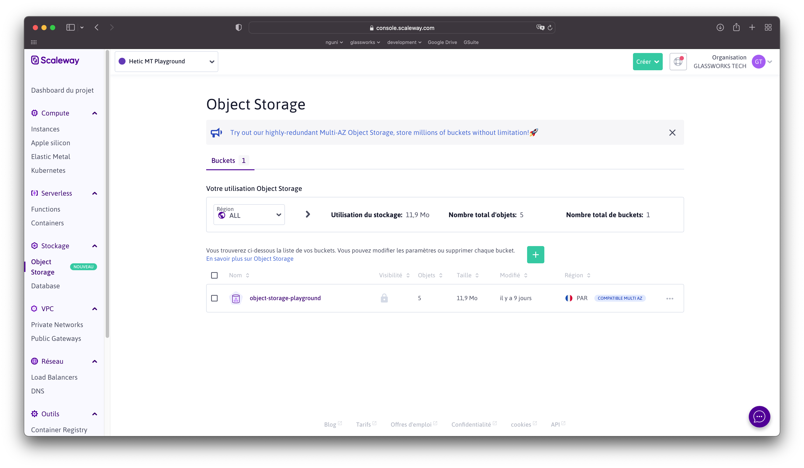
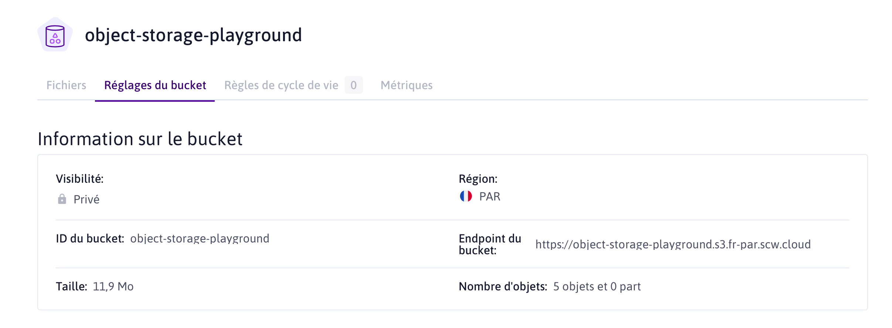

[[_TOC_]]

# Préparation

Cette branche ajoute une table à la base de données. Il faut mettre à jour le schéma. Dans VSCode

```sh
# Dans un terminal VSCode

mycli -h dbms -u root mtdb < ./dbms/ddl/ddl.sql 
```

# Téléchargement des fichiers

Dans un déploiement cloud on ne pourrait pas stocker des fichiers des utilisateurs localement (comme dans WordPress ou autre type de serveur) :
* On aimerait pouvoir dupliquer des processus de notre api plusieurs fois, sur plusieurs instances dans plusieurs pays
* Il faut donc un point centralisé et partagé de stockage


Amazon a eu énormément de succès avec leur protocole S3 pour le stockage "d'objets" dans le cloud. Aujourd'hui la plupart des fournisseurs cloud offre un service de stockage qui s'appelle "Object Storage", qui respecte la norme Amazon S3.

Le principe est qu'on stock un "objet" (un fichier) sous un chemin textuel, mais on n'a aucun détail concernant l'emplacement disque etc. Il y a un protocole HTTP qui permet d'envoyer des objets, récupérer des objets, les supprimer ou les interroger (pour de la meta-data).

## Buckets chez Scaleway

Chez Scaleway, il y a ce service :



Mais on trouve aussi les Object Storage chez Google, AWS (bien sur), OVH, etc.

On commence par créer un `bucket`, un seau dans lequel on va stocker nos fichiers. Un fois crée, il y a des information qu'on va utiliser dans notre API pour communiquer avec le bucket :



## Identification

Il est possible d'avoir des buckets ouvert au publique, ou privé. 
* Ouvert au publique : pour les blogs etc où on va juste références les images, fichiers etc dans notre html avec ``. Il n'y a pas de securité.
* Privé : on va exiger de la sécurité avant de récupérer les fichiers.

Pour un usage privé, il faut disposer des clés d'accès. Créer des clés d'accès change selon le fournisseur cloud, mais chez Scaleway on va dans Organisation (en haut à droite), Identifiants, Clés API. Ensuite on clique sur "Générer une nouvelle clé API".

Attention : le code secret s'affiche qu'une seule fois donc prenez note ! A tout moment si on constate de l'abus sur la clé, on peut la supprimer et remplacer avec une nouvelle.

## Outil pour parler avec l'Object Storage

Amazon maintien un package NodeJS pour le protocole S3 :

```sh
npm install @aws-sdk
```

[On va créer un outil qui implémente l'envoie et récupération des fichiers](../../src/classes/ObjectStorage.ts)


## Préciser des endpoints 

On va servir de cet outil pour uploader et downloader des fichiers pour notre utilisateur.

[UserFileUploadController](../../src/routes/auth/UserFileUploadController.ts)

A noter :
* La librairie [`multer`](https://www.npmjs.com/package/multer) pour la gestion des requêtes multi-part contenant des fichiers
* La création d'une clé unique et l'envoie au serveur
* L'utilisation d'une nouvelle table `user_file` pour stocker les références vers les fichiers dans le Object Storage
* La récupération et stream vers le client avec le chunks
* La documentation personnalisé avec [tsoa.json](../../tsoa.json)
